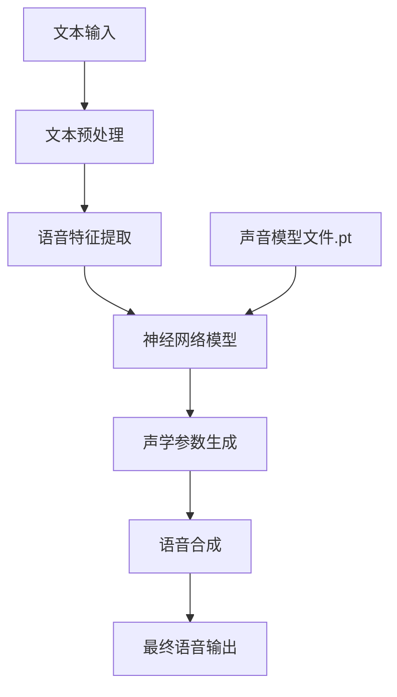

# Kokoro-82M 声音模型文件分析

Kokoro-82M Voices:
https://huggingface.co/prince-canuma/Kokoro-82M/tree/main/voices


``` 
af_alloy.pt
af_aoede.pt
af_bella.pt
af_heart.pt
af_jessica.pt
af_kore.pt
af_nicole.pt
af_nova.pt
af_river.pt
af_sarah.pt
af_sky.pt
am_adam.pt
am_echo.pt
am_eric.pt
am_fenrir.pt
am_liam.pt
am_michael.pt
am_onyx.pt
am_puck.pt
am_santa.pt
bf_alice.pt
bf_emma.pt
bf_isabella.pt
bf_lily.pt
bm_daniel.pt
bm_fable.pt
bm_george.pt
bm_lewis.pt
ef_dora.pt
em_alex.pt
em_santa.pt
ff_siwis.pt
hf_alpha.pt
hf_beta.pt
hm_omega.pt
hm_psi.pt
if_sara.pt
im_nicola.pt
jf_alpha.pt
jf_gongitsune.pt
jf_nezumi.pt
jf_tebukuro.pt
jm_kumo.pt
pf_dora.pt
pm_alex.pt
pm_santa.pt
zf_xiaobei.pt
zf_xiaoni.pt
zf_xiaoxiao.pt
zf_xiaoyi.pt
zm_yunjian.pt
zm_yunxi.pt
zm_yunxia.pt
zm_yunyang.pt
```


## 1. 技术概述

从提供的文件列表来看，这些是来自 hexgrad/Kokoro-82M 项目的声音模型文件（.pt 文件）。PT 文件是 PyTorch 模型的保存格式，用于存储训练好的神经网络模型参数。Kokoro-82M 应该是一个语音合成或声音克隆项目，包含了多种不同特征的声音模型。

### 文件命名规则分析

通过观察文件名的规律，可以发现这些文件采用了统一的命名规则：
```
[语言/地区代码][性别代码]_[名称].pt
```

其中：
- 第一部分（2个字母）：表示语言或地区
- 第二部分（1个字母）：表示性别（f 为女性，m 为男性）
- 第三部分：具体的声音名称或特征

## 2. 通俗解释

想象一下，这些文件就像是一个大型服装店里的不同衣架。每个衣架上挂着一套特定风格、特定尺寸的衣服。当你想要"穿上"某种声音时，你只需要选择对应的模型文件，计算机就会按照这个"衣架"上的样式来发出声音。

每个文件大小都是523 KB，这就像每个衣架的结构是一样的，但上面挂的衣服风格各不相同。这些模型可以让AI说话时听起来像不同的人，有男有女，来自不同国家，说话风格也各不相同。

## 3. 详细分析

### 文件分类

根据文件名前缀，我将这些声音模型分类如下：

| 前缀 | 可能代表的语言/地区 | 性别 | 包含的模型数量 |
|------|-------------------|------|--------------|
| af   | 美国英语 (American English) | 女性 (Female) | 11 |
| am   | 美国英语 (American English) | 男性 (Male) | 9 |
| bf   | 英国英语 (British English) | 女性 (Female) | 4 |
| bm   | 英国英语 (British English) | 男性 (Male) | 4 |
| ef   | 欧洲语言 (European) | 女性 (Female) | 1 |
| em   | 欧洲语言 (European) | 男性 (Male) | 2 |
| ff   | 法语 (French) | 女性 (Female) | 1 |
| hf   | 可能是希伯来语 (Hebrew) | 女性 (Female) | 2 |
| hm   | 可能是希伯来语 (Hebrew) | 男性 (Male) | 2 |
| if   | 可能是意大利语 (Italian) | 女性 (Female) | 1 |
| im   | 可能是意大利语 (Italian) | 男性 (Male) | 1 |
| jf   | 日语 (Japanese) | 女性 (Female) | 4 |
| jm   | 日语 (Japanese) | 男性 (Male) | 1 |
| pf   | 可能是葡萄牙语 (Portuguese) | 女性 (Female) | 1 |
| pm   | 可能是葡萄牙语 (Portuguese) | 男性 (Male) | 2 |
| zf   | 中文 (Chinese) | 女性 (Female) | 4 |
| zm   | 中文 (Chinese) | 男性 (Male) | 4 |

### 特征分析

1. **文件大小一致性**：所有模型文件都是523 KB，表明它们可能使用了相同的网络架构，只是参数不同。

2. **来源相同**：所有文件都标记为"Duplicate from hexgrad/Kokoro-82M"，表明它们来自同一个项目。

3. **性别分布**：
   - 女性声音模型：30个
   - 男性声音模型：24个

4. **语言/地区分布**：
   - 英语（美国和英国）：28个
   - 中文：8个
   - 日语：5个
   - 其他语言：13个

5. **命名特点**：
   - 美国英语女声(af)模型多用女性名字（如Jessica, Sarah）或自然元素（如Sky, River）
   - 美国英语男声(am)模型多用男性名字（如Adam, Eric）或特殊角色（如Santa）
   - 日语模型使用了一些动物或物品名称（如gongitsune狐狸、nezumi老鼠、tebukuro手套、kumo蜘蛛）
   - 中文模型使用了"小"字开头的女声（小北、小妮、小笑、小怡）和"云"字开头的男声（云健、云希、云夏、云阳）

## 4. 技术应用场景

这些声音模型文件可能应用于以下场景：

1. **文本转语音(TTS)系统**：将文本转换为自然语音，用于虚拟助手、导航系统等。

2. **声音克隆**：复制特定人物的声音特征，用于内容创作、配音等。

3. **多语言语音合成**：支持多种语言的语音生成，用于国际化应用。

4. **角色扮演和游戏**：为游戏或虚拟角色提供独特的声音。

5. **辅助技术**：为视障人士提供屏幕阅读或为语言障碍人士提供语音辅助。

## 5. 模型技术原理

这些.pt文件很可能是基于以下技术实现的：



Kokoro-82M 可能是一个拥有8200万参数的语音合成模型，采用了以下可能的技术：

1. **Transformer架构**：处理序列数据的强大架构
2. **声学模型**：将语言特征转换为声学特征
3. **声码器**：将声学特征转换为实际的音频波形
4. **微调技术**：基于少量数据调整预训练模型以适应特定声音

## 6. 代码示例：如何使用这些模型

以下是一个假设的Python代码示例，展示如何使用这些声音模型文件：

```java
import torch
import numpy as np
import sounddevice as sd
import time

class KokoroVoiceSynthesizer {
    private final String modelPath;
    private Object model;  // 实际应用中应该是特定的模型类
    
    public KokoroVoiceSynthesizer(String modelPath) {
        this.modelPath = modelPath;
        this.loadModel();
    }
    
    private void loadModel() {
        try {
            // 在实际应用中，这里会使用PyTorch的Java绑定或其他方式加载模型
            System.out.println("加载模型：" + modelPath);
            // 模拟加载模型的过程
            Thread.sleep(1000);
            System.out.println("模型加载完成");
        } catch (Exception e) {
            System.err.println("模型加载失败：" + e.getMessage());
        }
    }
    
    public byte[] synthesizeSpeech(String text) {
        System.out.println("使用模型 " + modelPath + " 合成文本：" + text);
        
        // 模拟语音合成过程
        try {
            Thread.sleep(500);  // 模拟处理时间
            
            // 在实际应用中，这里会调用模型进行真正的语音合成
            // 返回合成的音频数据
            return new byte[16000];  // 模拟返回音频数据
            
        } catch (Exception e) {
            System.err.println("语音合成失败：" + e.getMessage());
            return new byte[0];
        }
    }
    
    public static void main(String[] args) {
        // 示例：使用美国女声模型
        KokoroVoiceSynthesizer synthesizer = new KokoroVoiceSynthesizer("af_jessica.pt");
        
        // 合成语音
        byte[] audioData = synthesizer.synthesizeSpeech("Hello, this is Jessica speaking.");
        
        System.out.println("生成音频长度：" + audioData.length + " 字节");
        System.out.println("语音合成完成！");
        
        // 在实际应用中，这里会播放或保存音频
    }
}
```

## 7. 不同类型声音模型的特点对比

| 模型类型 | 可能的声音特点 | 适用场景 | 优势 | 局限性 |
|---------|-------------|---------|------|--------|
| af系列（美国女声） | 清晰、标准的美式发音，语调自然流畅 | 英语教学、虚拟助手、导航系统 | 口音纯正，易于理解 | 可能缺乏情感变化 |
| am系列（美国男声） | 低沉、稳重的美式发音 | 纪录片旁白、广告配音、公告系统 | 权威感强，适合正式场合 | 可能不适合儿童内容 |
| bf/bm系列（英国声音） | 优雅的英式发音，语调抑扬顿挫 | 教育内容、有声读物、历史节目 | 文化气息浓厚，适合文学作品 | 对非英语母语者可能较难理解 |
| jf/jm系列（日语声音） | 标准日语发音，语调和节奏符合日语特点 | 日语学习、动漫配音、日本文化内容 | 地道的日语表达，适合日语学习者 | 仅限日语内容 |
| zf/zm系列（中文声音） | 标准普通话发音，清晰流畅 | 中文教学、中文内容创作、中国市场应用 | 适合中文母语用户，发音准确 | 方言和情感表达可能有限 |
| 其他语言系列 | 各具语言特色的发音和语调 | 多语言应用、国际化内容、语言学习 | 支持多语言场景，扩展应用范围 | 每种语言的模型数量有限 |

## 8. 总结

Kokoro-82M 项目的这些声音模型文件代表了一个全面的多语言、多性别的语音合成系统。每个模型文件（.pt）包含了特定声音特征的参数，使AI系统能够模仿不同人物的说话风格。

这些模型按照语言/地区和性别进行了系统化的命名和组织，涵盖了英语（美式和英式）、中文、日语等多种语言，以及男性和女性声音。所有模型文件大小一致（523 KB），表明它们可能基于相同的网络架构，只是针对不同的声音特征进行了参数调整。

这种模型系统的设计使得开发者可以根据应用需求，选择最合适的声音模型，为不同的应用场景（如虚拟助手、导航系统、游戏角色等）提供自然、多样化的语音体验。


